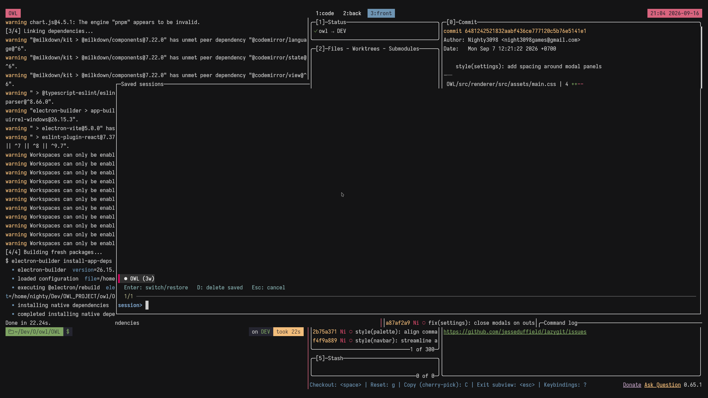

# tsession




A lightweight tmux session manager: prompt-based session switching/creation,
a session picker, and snapshot save/restore (windows, order, names, layouts,
working directories, running commands).

## Features

- **Prompt to switch or create** — press a key, type a session name. If the
  session exists you jump to it, otherwise it gets created.
- **Saved-session menu** — a popup listing sessions from the save file:
  `●` = alive (pick = switch), `○` = saved only (pick = restore + switch).
  With fzf it is interactive: `Enter` switches/restores the highlighted
  session, `D` deletes its snapshot right on the highlighted row.
- **Save / restore snapshots** — dump all sessions, windows, panes, layouts,
  cwd per pane and running commands into a single file, then bring everything
  back (e.g. after a reboot or `kill-server`), all at once or one session.
- **Zero dependencies** beyond tmux itself plus standard `base64` and `ps`.
  No Python, no fzf required.

## Default key bindings

All bindings live on the tmux prefix table:

| Keys              | Action                                                   |
| ----------------- | -------------------------------------------------------- |
| `Prefix + T`      | Prompt for a session name → switch to it or create it    |
| `Prefix + S`      | Menu of **saved** sessions (restore-or-switch)           |
| `Prefix + Ctrl-s` | Save the **current** session (merged into the save file) |
| `Prefix + Ctrl-r` | Restore all sessions from the save file                  |

## Requirements

- tmux 3.0+ (`display-popup`/`display-menu` need 3.2+)
- `base64` (coreutils), `ps` (procps) for save/restore command detection
- `fzf` (optional but recommended) for the interactive menu with inline delete

## Installation via TPM (recommended)

1. Make sure [TPM](https://github.com/tmux-plugins/tpm) is installed
   (usually at `~/.tmux/plugins/tpm`).
2. Add to your `~/.tmux.conf` **before** the `run tpm` line:

```tmux
set -g @plugin 'Nighty3098/tsession'

# optional overrides (defaults shown), must come BEFORE the run line:
# set -g @tsession-key 'T'
# set -g @tsession-menu-key 'S'
# set -g @tsession-save-key 'C-s'
# set -g @tsession-restore-key 'C-r'
# set -g @tsession-save-path '~/.tmux-tsession.save'
# set -g @tsession-kill-existing 'off'

run '~/.tmux/plugins/tpm/tpm'
```

3. Reload tmux config and install:

```bash
tmux source-file ~/.tmux.conf
# then inside tmux: Prefix + I  (capital i, TPM install)
```

4. Verify:

```bash
tmux list-keys -T prefix | grep -E "session-handler|save.sh|restore.sh"
```

## Manual installation (no TPM)

```tmux
# ~/.tmux.conf
set -g @tsession-key 'T'          # optional, defaults apply without these
run-shell /path/to/tsession/tsession.plugin.tmux
```

Then apply without restarting tmux:

```bash
tmux run-shell /path/to/tsession/tsession.plugin.tmux
# or: bash /path/to/tsession/tsession.plugin.tmux
```

> Do **not** load `tsession.plugin.tmux` with `tmux source-file` — it is a
> bash script executed via `run-shell`, not a tmux config file.

## Configuration

| Option                    | Default                 | Description                                                                                |
| ------------------------- | ----------------------- | ------------------------------------------------------------------------------------------ |
| `@tsession-key`           | `T`                     | Prompt for session name (switch/create)                                                    |
| `@tsession-menu-key`      | `S`                     | Menu of saved sessions                                                                     |
| `@tsession-save-key`      | `C-s`                   | Save snapshot                                                                              |
| `@tsession-restore-key`   | `C-r`                   | Restore snapshot                                                                           |
| `@tsession-save-path`     | `~/.tmux-tsession.save` | Snapshot file (`~` is expanded)                                                            |
| `@tsession-kill-existing` | `off`                   | `on` = entering an existing name kills it and creates a fresh session instead of switching |

Example:

```tmux
set -g @tsession-save-path '~/.local/share/tsession/sessions.save'
set -g @tsession-kill-existing 'on'
```

## Usage

### Switch or create a session

`Prefix + T`, type a name, hit Enter:

- name exists → your client switches to it,
- name is new → a detached session is created and you switch to it.

Notes: empty input cancels; `.` and `:` are replaced with `_` because tmux
forbids them in session names.

### Saved-session menu

`Prefix + S` opens a popup built from the **save file** (requires tmux ≥ 3.2),
not from live sessions.

With fzf installed (recommended) you get an interactive picker
(`display-popup` + fzf):

- type to fuzzy-filter, `● name (Nw)` = alive, `○ name (Nw)` = saved only
  (`Nw` = saved window count),
- `Enter` on the highlighted row — alive → switch; saved-only → restore that
  one session and switch to it,
- `D` (uppercase) on the highlighted row — delete that session's snapshot
  from the save file (live sessions are not touched); the list reloads
  in place. Lowercase `d` keeps working in the search query,
- `Esc` — cancel.

Without fzf it falls back to a static `display-menu` where Enter on a session
opens an action submenu (`Switch/Restore (S)`, `Delete saved session (D)`,
`Back (B)`), plus footer items `Save all`, `Restore all`, `New session…`.

If there is no save file yet, the menu tells you
to press `Prefix + Ctrl-s` first.

### Save: current session vs everything

`Prefix + Ctrl-s` (`scripts/save.sh --current`) snapshots only the **current**
session and merges it into the save file: that session's old snapshot is
replaced, all other sessions' snapshots are kept untouched. Re-saving is
idempotent — no duplicates.

`scripts/save.sh [path] [session]` covers the rest:

- no session → dump **all** live sessions (the file is rewritten; this is
  also what `Save all` in the menu footer does),
- a name (or `--current`) → merge one session as above.

What is stored per session:

- window order (indexes), window names, window layout (split geometry),
- per-pane working directory,
- full command line of the running program (resolved best-effort from the
  deepest child of `pane_pid`; bare shells are skipped),
- which window/pane/session was active.

### Restore everything

`Prefix + Ctrl-r` (or `scripts/restore.sh [path] [session]`) rebuilds the snapshot.

1. Same-named live sessions are killed so order/names/layouts come back
   exactly,
2. windows are recreated at their saved indexes with saved names,
3. extra panes are re-split and the saved `window_layout` is applied, so
   split geometry is exact,
4. cwd is restored via `-c`; non-shell commands are re-typed via `send-keys`,
5. active window/pane are re-selected and the client returns to the session
   that was attached at save time.

Passing a session name as second argument restores only that session and
switches to it — this is what the saved-session menu uses per item
(`scripts/goto-saved.sh '<name>'` does "switch if alive, else restore one").

## Save file format (v1)

`\x1f`-separated lines, paths/commands base64-encoded:

```
# tsession save v1 <UTC timestamp>
S\x1f<session_name>\x1f<attached 0/1>
W\x1f<session>\x1f<window_index>\x1f<window_name_b64>\x1f<active>\x1f<window_layout>
P\x1f<session>\x1f<window_index>\x1f<pane_index>\x1f<active>\x1f<cwd_b64>\x1f<cmd_b64>
```

## Scripts

```
tsession.plugin.tmux        # entry point: registers all bindings
scripts/
  session-handler.sh        # switch-or-create logic behind the prompt
  session-picker.sh         # menu entry: fzf popup, or display-menu fallback
  picker-fzf.sh             # interactive fzf list (Enter/D/Esc)
  list-saved.sh             # TSV list of saved sessions (label + name)
  session-menu.sh           # fallback static menu from save file
  session-action.sh '<name>' # fallback per-session submenu (switch/restore, delete, back)
  goto-saved.sh '<name>'    # switch if alive, else restore that one session
  delete-saved.sh '<name>' [path] # drop one session's snapshot from the file
  save.sh [--current] [path] [session] # current/all snapshot (merge for one)
  restore.sh [path] [session]  # rebuild all (or one) from snapshot
```

## Limitations

- Restore re-runs the program's **command line**, not its internal state
  (open file in vim, REPL history, etc.) — same class of limitation as
  tmux-resurrect without extensions. Coexists fine with tmux-resurrect.
- If a saved cwd no longer exists at restore time, `$HOME` is used.
- Saving is manual (`Prefix + Ctrl-s`); there is no autosave timer yet.

## License

See [LICENSE](LICENSE).
